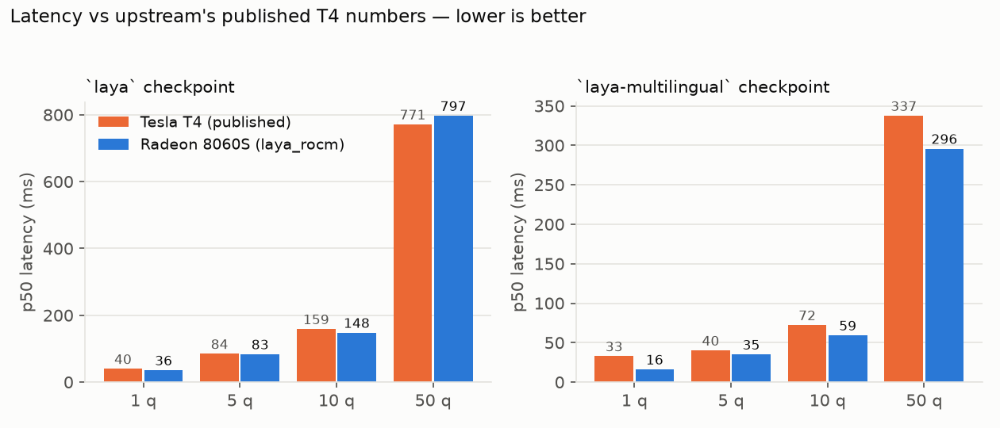
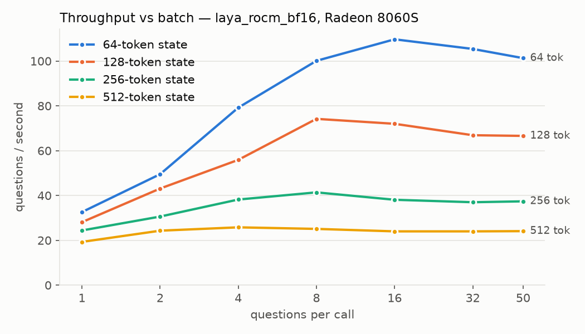
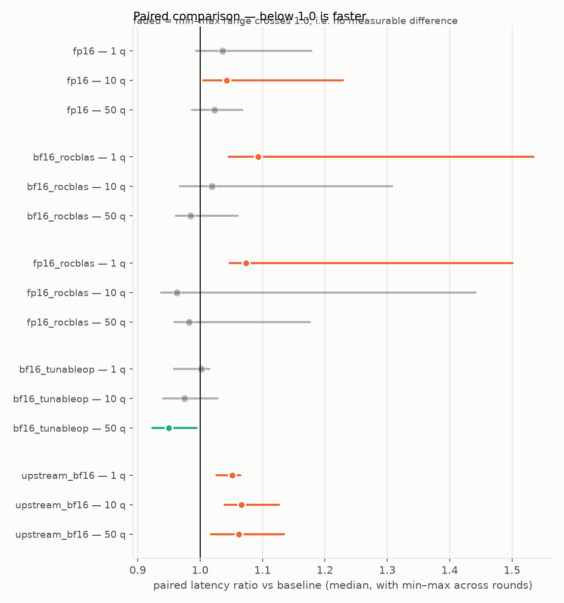

# laya-rocm

Drop-in AMD ROCm runtime for [Laya](https://github.com/NandhaKishorM/laya) — the calibrated
"System 1" decision model that answers typed questions about a JSON state with probabilities
instead of prose.

```python
import laya_rocm as laya          # instead of `import laya`

agent = laya.load("convaiinnovations/laya", device="cuda")   # "cuda" is correct on ROCm
```

Upstream Laya is already written against plain PyTorch, so in principle it runs anywhere PyTorch
runs. In practice, on a current ROCm stack, it picks its precision with an NVIDIA-only test, turns
HIP errors into crashes instead of the CPU fallback it intends, and — on torch ≥ 2.13 — cannot
complete a single GPU forward pass on a machine without a C compiler. This package fixes those
things, keeps the outputs identical, and publishes the measurements.

**Status:** works, tested, benchmarked on one machine (Radeon 8060S / gfx1151 / WSL2). Other ROCm
GPUs are expected to work but are unverified — see [Scope of testing](#scope-of-testing).

---

## Contents

- [Why this package exists](#why-this-package-exists)
- [Install](#install)
- [Verify the install](#verify-the-install)
- [Usage](#usage)
- [Performance](#performance)
- [How it works](#how-it-works)
- [Tuning guide](#tuning-guide)
- [Troubleshooting](#troubleshooting)
- [Scope of testing](#scope-of-testing)
- [Development](#development)

---

## Why this package exists

| | upstream `laya` on ROCm | `laya_rocm` |
|---|---|---|
| **Autocast precision** | `get_device_capability()[0] < 8` — an NVIDIA SM test. On AMD that tuple is the gfx version, so every AMD part passes it by accident | chosen from the gfx architecture: BF16 where the hardware has native BF16 matrix instructions (CDNA2+, RDNA3+), FP16 otherwise. `dtype=` overrides |
| **GPU error fallback** | falls back to CPU only when the message contains `"memory"` or `"cuda"`, so `HIP error: …` raises instead | also matches HIP / HSA / ROCm / "no kernel image" failures |
| **torch ≥ 2.13 without a C compiler** | **first GPU forward pass fails**: `RuntimeError: Failed to find C compiler`, from a Triton kernel in `torch._native` that JIT-builds a C launcher | detects the missing compiler, routes those ops back to the stock kernels, warns once |
| **Tokenization** | re-tokenizes the question text on every call and the state once per question | question head cached (LRU), state tokenized once per call — **token ids are byte-identical**, verified by tests |
| **Batching requests** | one state per call | `predict_many(states, questions)` — many states in one forward pass |
| **Backend control** | – | `blas=`, `fa=`, `tunableop=`, `native_triton=` |
| **Environment reporting** | – | `laya-rocm doctor` and `runtime.environment()` |

Outputs are unchanged: on CPU in FP32, `laya_rocm` returns results identical to `laya`, and on the
GPU it matches a CPU FP32 reference to within the precision of the chosen dtype
([measured](BENCHMARKS.md)).

---

## Install

**1. Install a ROCm build of PyTorch first**, following
[AMD's instructions](https://rocm.docs.amd.com/projects/ai-ecosystem/en/latest/frameworks/pytorch/install.html)
for your GPU. `laya-rocm` deliberately does **not** pin `torch`, so pip will never replace your
ROCm wheel with a CUDA or CPU one.

**2. Install the package** (pulls upstream `laya>=0.3.5,<0.4`):

```bash
pip install laya-rocm            # once published
pip install git+https://github.com/don-milsey-miller/laya-ROCm    # from source
```

### WSL2 on Windows (Radeon / Ryzen AI) — optional helper

On native Linux nothing else is needed. WSL2 is harder: ROCm reaches the GPU through
[librocdxg](https://github.com/ROCm/librocdxg), and a minimal image lacks `libgomp` and often a
usable `python3-venv`. `scripts/setup_wsl.sh` builds a complete environment under `~/.laya-rocm`
**without sudo**:

```bash
bash scripts/setup_wsl.sh gfx1151      # your gfx target; default gfx1151
source ~/.laya-rocm/env.sh             # or: bash scripts/wsl.sh <command>
```

It installs `uv` (which supplies Python), unpacks librocdxg and libgomp into your home directory,
creates the venv, and installs the ROCm PyTorch wheel plus this package. Requirements: Windows 11,
AMD Adrenalin ≥ 26.2.2, WSL2. Re-running it is safe.

Optional: `sudo apt install gcc` enables PyTorch's Triton-backed native ops and `torch.compile`.
Without it, `laya_rocm` falls back to the stock kernels automatically — nothing breaks.

---

## Verify the install

```bash
laya-rocm doctor              # environment + load the model on the GPU and answer one question
laya-rocm doctor --no-smoke   # environment only, no download
```

```json
{
  "wsl": true,
  "torch": "2.13.0+rocm10.0.0",
  "hip": "7.15.26333",
  "gpu_available": true,
  "gpu": "AMD Radeon(TM) 8060S Graphics",
  "gfx_arch": "gfx1151",
  "compute_units": 20,
  "vram_gib": 17.65,
  "bf16_supported": true,
  "backends": {
    "blas": "Cublaslt",
    "fa": "AOTriton",
    "ck_sdpa_available": false,
    "tunableop": "off",
    "native_triton": false,
    "c_compiler": null
  }
}
```

`doctor` exits non-zero if PyTorch is not a ROCm build, if no GPU is visible, or if the model
silently lands on the CPU — the failure mode that otherwise looks like success, just slower.
On ROCm, `"blas": "Cublaslt"` means hipBLASLt: PyTorch reuses the CUDA names for HIP.

---

## Usage

### Basics

The API is upstream's. A *state* is any JSON-able value; *questions* are `choice`, `score` or
`noul` (yes/no), and each answer carries calibrated probabilities.

```python
import laya_rocm as laya

agent = laya.load("convaiinnovations/laya", device="cuda")

questions = {
    "team": {"type": "choice",
             "instructions": "Which team should handle this?",
             "criteria": {"billing": "payments and invoices",
                          "technical": "bugs and integrations",
                          "sales": "pricing questions"}},
    "urgent": {"type": "noul", "instructions": "Is `ticket.text` urgent?"},
}
state = {"ticket": {"text": "I was charged twice and need a refund today."}}

result = agent.predict(state, questions)
```

```json
{
  "model": "laya-rl-agent",
  "answers": {
    "team": {
      "type": "choice",
      "choice": "billing",
      "probabilities": {"billing": 0.977, "technical": 0.0099, "sales": 0.0132},
      "confidence": 0.8859,
      "action": {"act_probability": 1.0}
    },
    "urgent": {
      "type": "noul",
      "noul": 0.8349,
      "confidence": 0.8349,
      "action": {"act_probability": 1.0}
    }
  },
  "usage": {"input_tokens": 102, "output_tokens": 0}
}
```

Always check where the model actually ended up:

```python
print(agent.device, agent.dtype)      # cuda torch.bfloat16
```

### Batching several requests: `predict_many`

The one API addition. It answers the same question set for many states in a single forward pass —
useful for a queue with a short collection window:

```python
results = agent.predict_many([state_a, state_b, state_c], questions)   # list, in order
```

Each element has exactly the shape `predict()` returns. On a GPU that a single call already
saturates the gain is modest (see [Performance](#performance)); on smaller checkpoints, or with
short states, it is larger.

### Routing between checkpoints

```python
router = laya.Router(models={"english": "convaiinnovations/laya",
                             "multilingual": "convaiinnovations/laya-multilingual"},
                     device="cuda", max_loaded=2,
                     rocm_options={"dtype": "fp16"})      # applied to every agent it builds
router.predict(state, questions)
```

### Options

```python
agent = laya.load(
    "convaiinnovations/laya",
    device="cuda",
    dtype="auto",           # 'auto' | 'bf16' | 'fp16' | 'fp32'
    blas=None,              # 'hipblaslt' | 'hipblas' | 'rocblas' | 'default'
    fa=None,                # 'aotriton' | 'ck' | 'default'   (flash attention behind SDPA)
    tunableop=None,         # 'tune' | 'use' | 'off'
    tunableop_file=None,    # path to the tuned-GEMM CSV
    native_triton="auto",   # 'auto' (off without a C compiler) | 'on' | 'off'
    head_cache_size=4096,   # tokenized question heads to keep; 0 disables
)
```

`None` means "leave PyTorch's own choice alone", which is the default for every backend knob.
Backend selection is **process-global** and must happen before the first forward pass, so set it
when you construct the agent. The same settings are available directly:

```python
from laya_rocm import runtime
runtime.configure(blas="rocblas", tunableop="use", tunableop_file="tuned.csv")
runtime.environment()     # the full hardware/software tuple, for logging with results
runtime.is_rocm(), runtime.is_wsl(), runtime.gfx_arch()
```

---

## Performance

Radeon 8060S (Ryzen AI Max+ 395, gfx1151, 20 CUs, 17.65 GiB unified memory) under WSL2, torch
2.13 + ROCm 10, against upstream's **published Tesla T4 figures** (torch 2.11 + CUDA 12.8, not
re-measured here). Full detail, including accuracy and calibration, in [BENCHMARKS.md](BENCHMARKS.md).



| | 1 question | 10 questions | 50 questions |
|---|---:|---:|---:|
| `laya` on T4 (published) | 39.5 ms | 158.6 ms | 771.3 ms |
| **`laya` on 8060S** | **35.5 ms** | **147.7 ms** | **796.8 ms** |
| `laya-multilingual` on T4 (published) | 32.8 ms | 72.3 ms | 337.4 ms |
| **`laya-multilingual` on 8060S** | **16.1 ms** | **59.2 ms** | **295.7 ms** |

Throughput saturates around 110 questions/s on the 421M-parameter English checkpoint; longer
states cost proportionally more, and batching questions into one call is what buys throughput:



### Measurement honesty

This is an integrated GPU: it shares power, thermal budget and memory bandwidth with the CPU, and
its clocks move with the machine's state. **The same unchanged configuration, measured at
different times across one afternoon, varied by 28% at one question and 10% at fifty.** That is
larger than most differences between settings, so configurations are compared in *paired rounds* —
every configuration runs back to back in each round, and the ratio within a round is what
survives the drift (`bench/bench_ab.py`).



What holds up (5 rounds, ranges that do not cross 1.0):

| Change | Effect | Verdict |
|---|---|---|
| `laya_rocm` vs upstream `laya` | 5–6% faster at every batch size | real, from cached tokenization |
| `tunableop="use"` | 5% faster at 50 questions; nothing at 1 | real, but costs ~1 h of tuning per GPU |
| `dtype="fp16"` | 4% **slower** at 10 questions | accuracy play, not a speed play |
| `blas="rocblas"` | 9% slower at 1 question, nothing when batched | not worth switching |

### Numerical agreement

Every configuration is scored against a **CPU FP32 reference** on 2,000 typed-decisions questions.
This matters more than speed for Laya, because applications gate on confidence thresholds:

| Config | top-1 agreement | mean \|Δp\| | p99 \|Δp\| | flips at 0.85 |
|---|---:|---:|---:|---:|
| GPU FP32 | 1.0000 | 0.00000 | 0.0000 | 0 / 2000 |
| **GPU FP16** | **0.9990** | 0.00054 | 0.0025 | **0 / 2000** |
| GPU BF16 (default) | 0.9915 | 0.00402 | 0.0151 | 2 / 2000 |

FP16 tracks FP32 roughly six times more closely than BF16 at the same speed class: BF16's wider
exponent buys nothing for this model, while its shorter mantissa costs precision. **If your
application automates on a confidence threshold, pass `dtype="fp16"`.** It is not the default
because that conclusion comes from one GPU.

Accuracy itself is unaffected: typed-decisions lands between 0.3590 and 0.3620 across every GPU
configuration, against 0.3620 published on the T4, and the CPU FP32 reference reproduces that
published figure to within 0.0005 (0.3615). That agreement is what makes the rest of the
comparison trustworthy — the harness measures what upstream measured.

---

## How it works

`laya_rocm` re-exports everything from `laya` and replaces four names with subclasses of the
originals. There is no vendored model code and no compiled extension:

| File | Contents |
|---|---|
| `__init__.py` | `from laya import *`, then `Agent`, `RLAgent`, `load`, `Router` overridden |
| `agent.py` | precision selection, HIP-aware fallback, cached tokenization, `predict_many` |
| `runtime.py` | `is_rocm`, `is_wsl`, `gfx_arch`, `configure`, `environment`, the compiler check |
| `router.py` | `Router` that builds `laya_rocm.Agent` instances |
| `__main__.py` | the `doctor` command |

**Precision.** `preferred_amp_dtype()` keeps the checkpoint's BF16 only where the architecture has
native BF16 matrix instructions — MFMA on `gfx908/90a/94x/95x`, WMMA on `gfx11xx/12xx` — and drops
to FP16 elsewhere (RDNA1/2, Vega), which those parts execute natively. Upstream's NVIDIA
compute-capability test is never consulted on ROCm.

**Fallback.** Upstream catches GPU failures by substring, matching only `"memory"` and `"cuda"`.
ROCm reports `HIP error: …`, `hipErrorNoBinaryForGpu`, `HSA_STATUS_ERROR_…`, so the fallback never
fired. `laya_rocm` adds those markers, and a fallback moves the model to CPU FP32 under a lock and
retries the batch.

**The compiler problem.** On torch ≥ 2.13, `torch._native` overrides `aten::bmm` with a Triton
kernel for outer-product shapes — which is exactly what ModernBERT's rotary embedding produces.
The first use makes Triton compile a small C launcher, and on an image without `gcc` that raises
`Failed to find C compiler`, so **no GPU forward pass completes at all**, with or without this
package. `laya_rocm` looks for a compiler the same way Triton does (`$CC`, then `gcc`, then
`clang`) and, finding none, calls
`torch._native.registry.deregister_op_overrides(disable_dsl_names="triton")`, which routes those
ops back to the stock ATen/hipBLAS kernels. Results are unchanged; `torch.compile` still needs a
compiler. `TORCH_DISABLE_NATIVE_JIT=1` is the environment-variable equivalent.

**Tokenization.** Upstream's `build_sequence` re-renders every question for every call.
`laya_rocm` splits the sequence into a question head (instructions + option markers), cached with
an LRU keyed by question type, instructions and options, and the per-call state. The tests assert
the resulting token ids and marker positions are identical to upstream's for a matrix of question
shapes and states — including truncation, option-budget overflow, `[MASK]` in text, unicode and
empty states — so caching can never silently change an answer.

---

## Tuning guide

Worth doing only for a long-lived service with stable request shapes.

```bash
# 1. tune: benchmarks kernel candidates for every GEMM shape your workload produces (slow)
python - <<'PY'
import laya_rocm as laya
agent = laya.load("convaiinnovations/laya", device="cuda",
                  tunableop="tune", tunableop_file="tuned.csv")
... run traffic that looks like production ...
PY

# 2. use: replay the tuned choices, no tuning cost
agent = laya.load("convaiinnovations/laya", device="cuda",
                  tunableop="use", tunableop_file="tuned.csv")
```

Tune the shapes you actually serve: a CSV tuned on 50 questions × 512 tokens tells you nothing
about 4 × 250. The file records the ROCm, PyTorch, rocBLAS and hipBLASLt versions and is rejected
after an upgrade; it is specific to the GPU that produced it, which is why this repository ships
no tuned CSV.

---

## Troubleshooting

| Symptom | Cause and fix |
|---|---|
| `RuntimeError: Failed to find C compiler` | torch ≥ 2.13 Triton op without `gcc`. Upgrade to `laya_rocm`, or `sudo apt install gcc`, or set `TORCH_DISABLE_NATIVE_JIT=1` |
| `agent.device` is `cpu` after asking for `cuda` | the GPU load failed and fell back. The warning says why; `laya-rocm doctor` fails loudly on this |
| `torch.cuda.is_available()` is `False` in WSL | install librocdxg; for ROCm < 7.13 also `export HSA_ENABLE_DXG_DETECTION=1` (both handled by `scripts/setup_wsl.sh`) |
| `libgomp.so.1: cannot open shared object file` | minimal WSL image; `scripts/setup_wsl.sh` unpacks it into `~/.laya-rocm/sysdeps` |
| `torch.compile` fails | needs a C compiler; unavailable in a minimal WSL image |
| Confidence values differ slightly from CPU | expected for BF16/FP16 autocast. Quantified in [BENCHMARKS.md](BENCHMARKS.md); use `dtype="fp16"` or `"fp32"` if thresholds matter |
| `ValueError: … options exceed head_max_len` | too many/long options for the checkpoint's head budget — upstream behaviour, not ROCm-specific |

---

## Scope of testing

Validated on **one machine**: Radeon 8060S iGPU (Ryzen AI Max+ 395, gfx1151), WSL2 on Windows 11,
torch 2.13 + ROCm 10, upstream laya 0.3.5.

Nothing in the package is specific to that machine — precision is chosen per architecture and all
backend settings default to PyTorch's own choices — but **other ROCm GPUs are expected to work
rather than proven**, and CK flash attention could not be exercised (unavailable on gfx1151).
CI runs the tokenization-parity, dtype and API tests on CPU only.

Benchmark numbers, and every tuning conclusion drawn from them, come from that one machine. None
of them changes a default for anyone else. Reports from other hardware — especially native Linux,
discrete RDNA and CDNA/Instinct parts — are very welcome.

---

## Development

```bash
pip install -e ".[test,bench]"

pytest -q tests                                     # fast: parity, dtype table, API superset
LAYA_RUN_MODEL_TESTS=1 pytest -q -m model tests     # downloads the checkpoint
LAYA_RUN_MODEL_TESTS=1 pytest -q -m gpu tests       # needs a ROCm GPU
```

Reproducing the benchmarks:

```bash
python bench/run_matrix.py          # every configuration, each in a fresh process
python bench/bench_ab.py --rounds 5 # paired comparison, drift-resistant
python bench/make_report.py         # -> BENCHMARKS.md and results/plots/
```

`laya_rocm` subclasses upstream internals, so it pins `laya<0.4` and is tested against each laya
release before the pin moves.

## License

Apache-2.0, matching upstream Laya. `bench/common.py` adapts metric and dataset code from
upstream's `research/scripts/build_benchmark_nb.py`.
